# Basic Information

## GAN 소개

앞서, CNN같은 경우에는 개와 고양이에 레이블을 부여하여, 이미지를 분류하는 문제였다면, Generative Adversaial Network의 줄임말인 GAN은 이미지 생성에 관하여 많이 쓰이는 모델이다. Image Generation\(이미지 생성\)은 말 그대로 데이터셋 과 유사한 이미지를 만들어내는 것이다. 이미지를 분류하는 것보다 더 어려운 task에 속한다.

## GAN의 아이디어

GAN은 2014년 Ian Goodfellow님의 논문으로 아이디어가 처음으로 발표되었다. GAN의 이미지 생성에 대한 원리를 '위조지폐범과 경찰'로 설명하는 방식이 대표적이다.

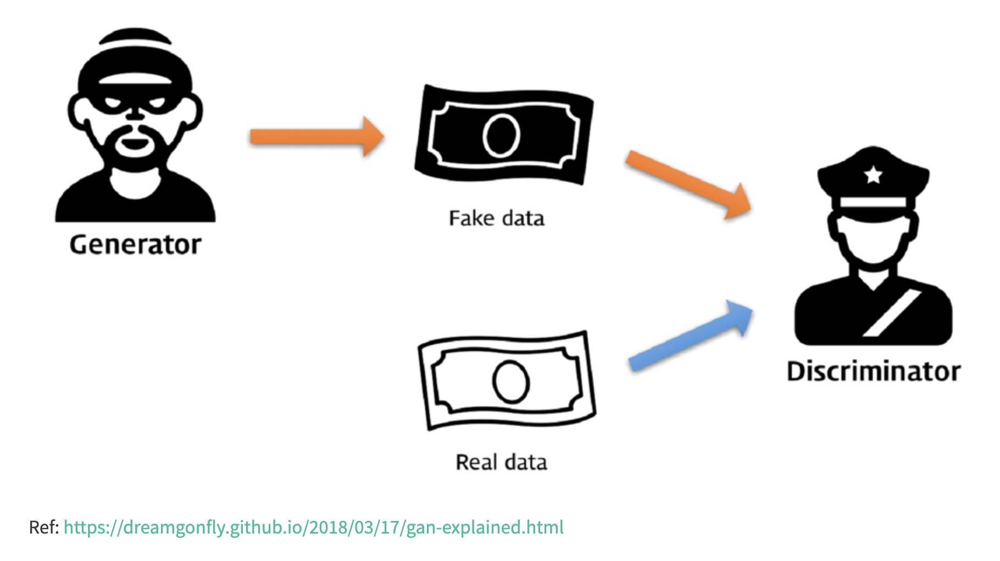

위조지폐범은 계속하 실제 돈과 매우 유사한 위조지폐를 만들어서 경찰을 속이려고 할 것이다. 그리고 경찰은 지폐가 진짜인지 가짜인지 끊임없이 구분하고자 할 것이다. 이렇게 위조지폐범과 경찰은 '적대적인 관계'에 있는 것이며, 서로 속고 속이는 싸움이 이어지는 것이다. 

GAN에서 우리는 이미지를 생성하는 위조지폐범인 **'Generator\(생성자\)'**가 있고, 이를 판별하는 경찰인 **'Discriminator\(판별자\)'**가 있다. Generator는 계속해서 실제 이미지 데이터를 토대로, 최대한 잘 속일 수 있는 이미지를 생성하는 확률을 높여가고, 판별자는 제대로 구분할 수 있는 확률을 높이고자 한다. 그렇게, 서로 적대적인 관계에 있으면서 학습을 진행하는 것이다. \(GAN은 한국어로 '생산적 적대 신경망'이라고 불린다\)

## GAN in ML\(Machine Learning\)

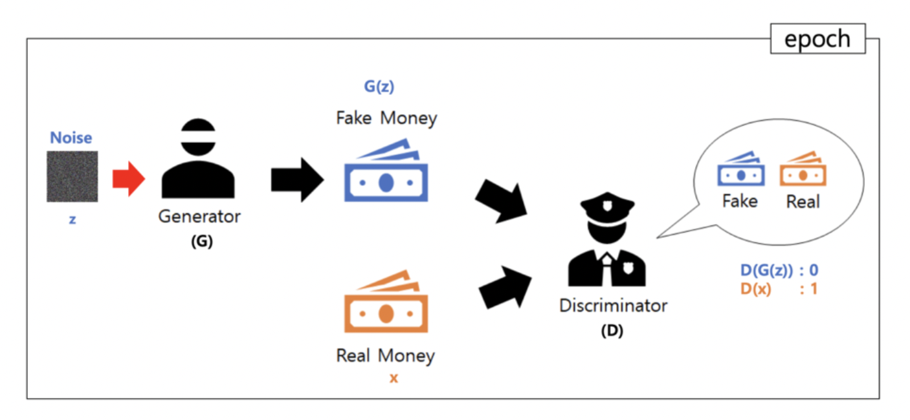

노이즈\(z\)가 있는 위조지폐를 Generator가 만들었으니 `G(z)`라 하고 실제 지폐를 `x`라고 부른다. 그리고, Discriminator에게 넘겨질 때, G\(z\)를 받을 때는 `D(G(z))`로 0을 출력하고, x를 받는 경우에는 `D(x)`로 1을 출력하도록 한다. 경찰이 한 번의 판단을 내리기까지가 머신러닝에서의 한 번의 epoch가 되는 것이다.

이 과정을 계속 반복하다 보면, 위조지폐범이 위조지폐를 만드는 실력도 올라가고, 경찰도 더 잘 구분할 수 있게 된다. 그리고, 어느순간 완벽한 위조지폐가 탄생하여 구분할 수 있는 확률이 50%가 된다면, 학습을 종료하게 된다. 

AutoEncoder에서 '지도학습'과 '비지도학습'에 대하여 언급했던 적이 있다. GAN 같은 경우에는 Generator는 Unsupervised Learning\(비지도학습\)에 속하고, Discriminator는 Supervised Learning\(지도학습\)에 속한다. 

## GAN의 원리

### 1\) 확률분포 개념

확률분포는 사실 GAN 뿐만 아니라, Generator가 들어가는 모델들을 이해하기 위해 꼭 필요한 개념이다.

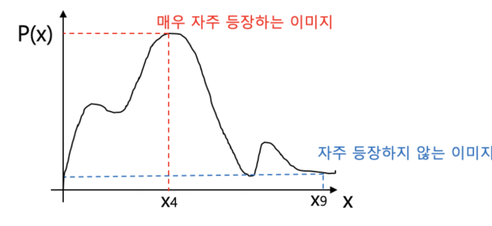

이번 GAN에서 고양이 사진을 제작한다고 생각해보자. 가로축에 있는 X는 고양이 사진의 종류이다. X4에 해당하는 고양이의 사진이 자주 등장하고, X9에 해당하는 고양이의 사진은 자주 등장하지 않는다면, 확률을 y축으로 가지는 위와 같은 그래프를 그릴 수 있을 것이다. 결국, Generator의 목적은 밑의 사진처 실제 데이터 분포와 유사한 모델을 제작하는 것이다.

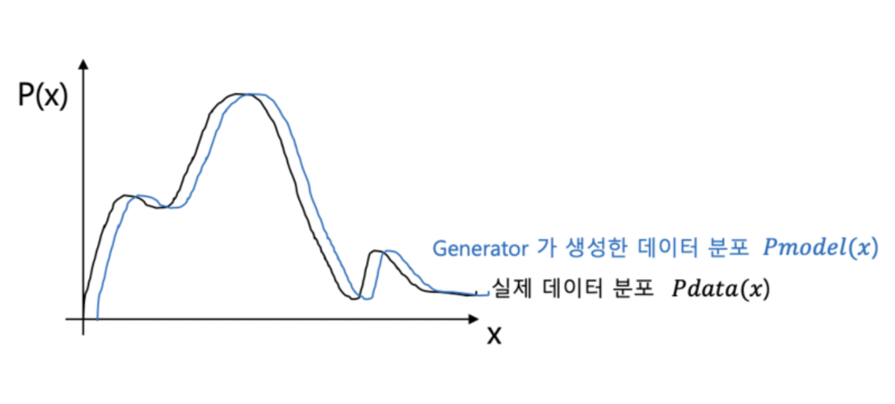

 GAN에서는 Discriminator가 Generator 이전에 진짜 이미지와 가짜 이미지를 구별할 수 있도록 학습을 진행한다. Sigmoid 함수를 이용해서, 0.5를 기준으로 0과 1의 output을 얻게 되는 것이다. Generator 입장에서는 0과 1이 중요치 않으며, 그저 `D(G(z))`가 1이 되도록 하는 것이 최우선 목표이다.

### 2\) GAN의 수학적 원리

밑에 있는 수식은 GAN에서의  핵심이 되는 수식이다. 좌변에서 `V(G, D)`는 GAN의 Loss Function을 나타내며, Generator는 이 값을 최소로, Discriminator는 이 값을 최대로 하는 것을 목표로 한다. 

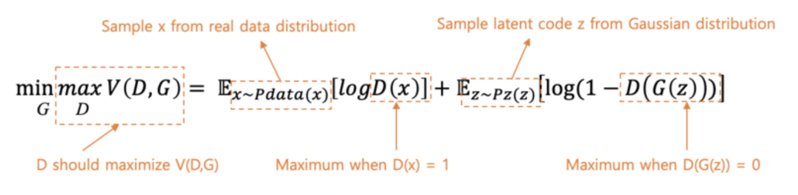

#### 1\) Discriminator의 입장

Discriminator는 `V(D, G)`를 최대로 만들어야한다. 그러기 위해서는, `D(x)`를 1로 만들어야 한다. 그리고, 동시에  `D(G(z))`는 0으로 만들어야 한다. 

**Q. `D(x)`가 1이 되면 `logD(x)`는 0이 되지 않는가?  
Q. `D(G(z))` 또한 음수가 된다면  Loss Function의 값을 더 크게 얻을 수 있지 않은가?**

Discriminator는 위에서 언급한 것과 같이 Sigmoid 함수를 이용하여, 0과 1사이의 값만 반환한다. 즉, 식에서 값이 `V(D, G) = ( 0 + 0 )`과 같은 형태가 바로 최댓값인 것이다. Discriminator는 결국 `D(x)`가 1, `D(G(z))`는 0을 출력하도록 하도록 최선을 다하는 것이다. 두 항의 값 모두 0이 최선이지만, 상대적으로는 D가 `V(D, G)`를 최대화 하려고 노력한 값이다.

#### 2\) Generator의 입장

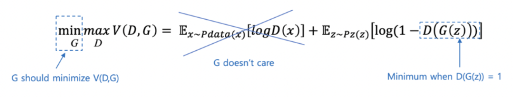

Generator는 위에서 잠깐 언급한 것처럼 Discriminator가 진짜 지폐에 대해서 어떤 값을 출력하는지에 대해서는 관심이 없다. 오직, 자신이 제작한 위조지폐를 `D(G(z))`를 최대한 1에 가깝게 출력하는 것이 목표이다. `D(G(z))`가 1에 가까워질수록, Loss Function은 `log(1-1)`의 형태로 음의 무한대로 향하는 형태가 된다. 즉, Generator는 Loss Function을 최소로 만드는 데에 목표가 있다. 

## GAN의 종류

앞에서 설명한 것은 기본적인 GAN에 속하며, 이외에도 파생된 수많은 GAN의 종류가 존재한다. 이 중에 몇 개만 소개하고자 한다. \(밑 표에 표시되어 있는 GAN이 전부가 아니며, 다른 종류의 GAN 또한 많이 존재한다\)

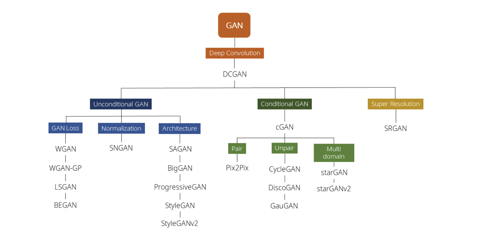

### 1\) DCGAN\(Deep Convolutional GAN\)

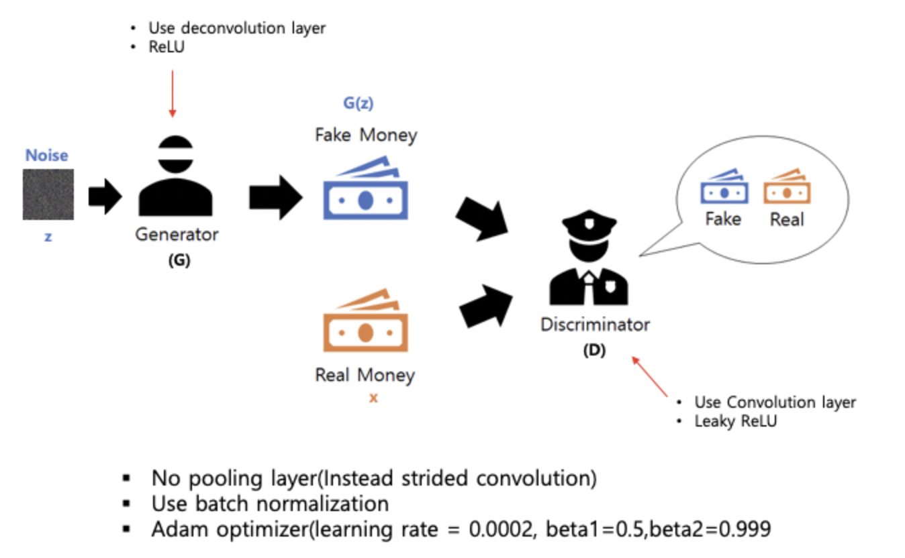

DCGAN은 Generator와 Discriminator에서 Convolution layer을 사용하는 GAN을 말한다.

### 2\) LSGAN\(Least Squares GAN\)

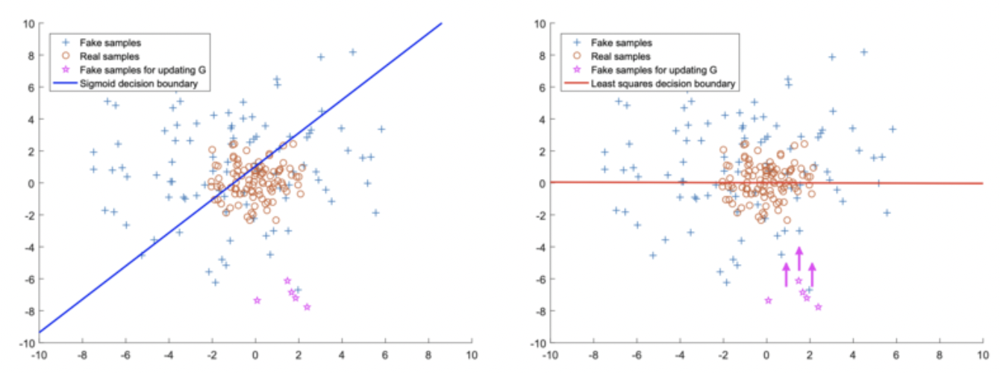

### 3\) CycleGAN

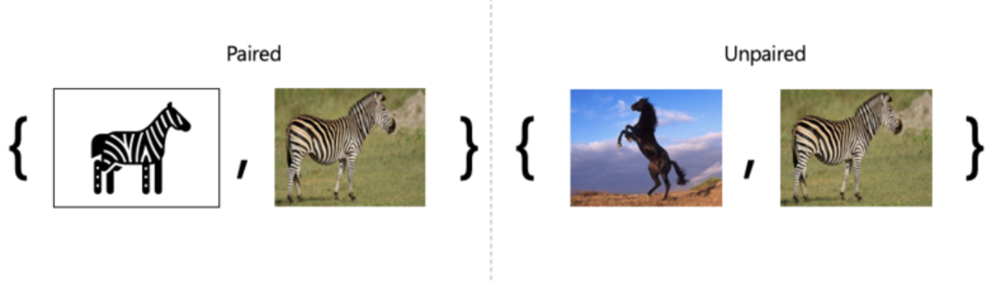

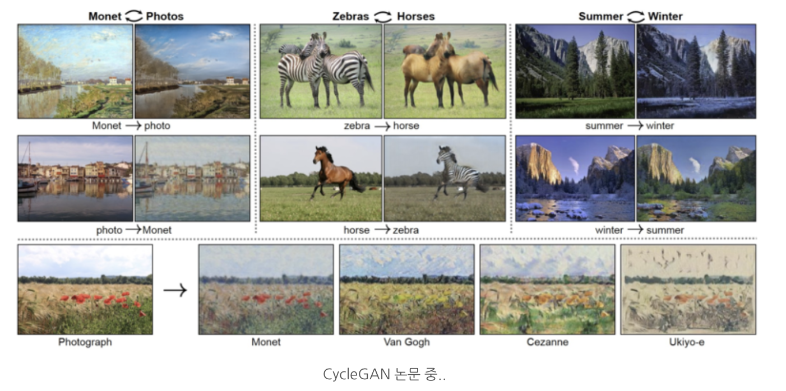

사진 및 내용 출처:  
[https://ysbsb.github.io/gan/2020/06/17/GAN-newbie-guide.html](https://ysbsb.github.io/gan/2020/06/17/GAN-newbie-guide.html)  
[https://m.blog.naver.com/euleekwon/221557899873](https://m.blog.naver.com/euleekwon/221557899873)

