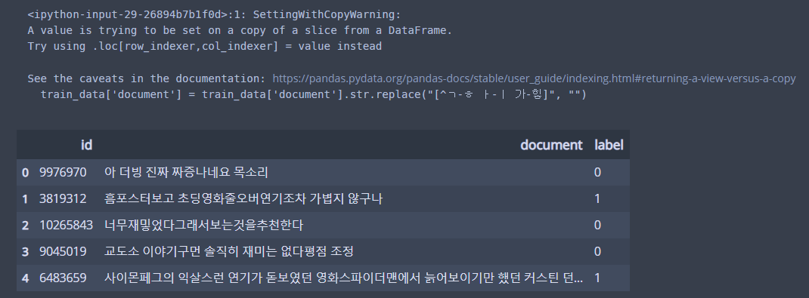

# Sentimental Classification

### 1\) Data Loading

```python
import torch
import torchvision
import torch.nn.functional as F
from torch import nn, optim
from torchvision import transforms, datasets

import matplotlib.pyplot as plt
from mpl_toolkits.mplot3d import Axes3D
from matplotlib import cm
import numpy as np
import pandas as pd
import urllib.request
```

시작하기에 앞서 필요한 라이브러리를 불러와줍니다. 

```python
urllib.request.urlretrieve("https://raw.githubusercontent.com/e9t/nsmc/master/ratings_train.txt", filename="ratings_train.txt")
urllib.request.urlretrieve("https://raw.githubusercontent.com/e9t/nsmc/master/ratings_test.txt", filename="ratings_test.txt")
```

[https://github.com/e9t/nsmc/](https://github.com/e9t/nsmc/)  
위 github 링크에서 네이버 영화 리뷰 데이터셋을 다운받을 수 있다. `urllib.request`를 이용해서 폴더 내로 영화 리뷰 모음을 txt파일로 저장한다. 파일 이름은 훈련 데이터, 테스트 데이터 각각 "ratings\_train.txt"와 "ratings\_test.txt"로 저장했다.

```python
train_data = pd.read_table('ratings_train.txt')
test_data = pd.read_table('ratings_test.txt')

print('number of training data :', len(train_data))
train_data[:5]
```

다운받은 데이터셋을 pandas 데이터프레임으로 만든다. 앞으로 진행할 데이터 전처리에서 pandas에 내장되어 있는 유용한 함수를 계속하여 사용할 예정이다. 

현재 총 존재하는 data는 `number of training data : 150000`으로 확인할 수 있다.  
밑 사진에서 데이터프레임의 상위 5개 데이터를 확인할 수 있다. train\_data 데이터프레임의  'id', 'document', 'label'로 이루어져있다. label은 '부정'과 '긍정'의  0과 1만 존재한다. 


### 2\) Data Preprocessing

```python
train_data['document'].nunique(), train_data['label'].nunique()
train_data.drop_duplicates(subset=['document'], inplace=True)

print('total number of sample :', len(train_data))
```

`.nunique()`를 이용해서, 'document' 열과 'label' 에서 중복된 데이터가 있는지 확인한다.  
`(146182, 2)` 15만 개의 데이터 중에서 'document' 열 중복된 데이터를 제거한 샘플의 개수가 146182개가 됨을 뜻한다. 'label'의 열은 0 혹은 1의 값만을 가지므로, 2가 출력되는 것이다.

`.drop_duplicates(subset=['document'], inplace=True)`를 이용해서, 'document' 열에서 중복되는 값을 삭제한다. \(inplace=True는 원본 데이터를 변경함을 의미한다\)  
그리고, 총 샘플의 개수를 확인하면, `total number of sample : 146183`으로 확인할 수 있다. 

```python
print(train_data.isnull().sum())
train_data.loc[train_data.document.isnull()]

train_data = train_data.dropna(how = 'any')
print(train_data.isnull().values.any())
```

다음은 'document' 열에서의 Null 값의 유무를 알아보자. 밑 사진과 같이, 'document' 열에서 Null 값이 하나 존재함을 알 수 있다. 

  
`.dropna(how = 'any')`를 이용하여 Null 값을 가진 샘플을 제거한다. \(.dropna는 Null 값이 있는 을 삭제하는 함수다. 그리고, how = 'any'는 한 행에서 Null이 한 개라도 있으면 그 행을 삭제함을 의미한다. how = 'all'로 하면 모든 값이 Null이 되야 한다\)  

그리고, `print(train_data.isnull().values.any())`로 남아있는 Null 값을 확인하면 `False`를 출력함으로써, Null 값을 전부 제거 했음을 확인한다.


```python
print('total number of sample :', len( train_data))
print(train_data.groupby('label').size().reset_index(name = 'count'))
```

중복값과 Null 값을 전부 제거한 데이터의 개수는 146182개다.  
그리고, label 0과 1의 개수를 세면, '긍정'을 뜻하는 리뷰가 근소하게 더 많음을 알 수 있다.


```python
import re
text = 'Hi !!! are you .... interested studying ??!!@@ ,, AI ?..'
re.sub(r'[^a-z A-Z]', '', text)
```

네이버 영화  리뷰 데이터셋을 보면, 오직 한국어뿐만 아니라 수많은 문장부호와 기호들과 함께 이루어져있다. `re` 라이브러리를 import 하여 데이터프레임에서 한국어와 공백을 제외한 나머지를 제거해주도록 하자.  
`re.sub(r'[^a-z A-z]', ' ', text)`에서 알파벳 소문자와 대문자, 공백을 제외한 나머지 text에서 날려준다. \(`^`를 빼면, 알파벳과 공백을 모두 제거한 나머지를 보여준다. 그리고, `r'[^a-z A-Z]'`에서 `r`과 `'` 사이를 띄어쓰기 하면 syntax error가 발생한다\)

그렇다면, 한국어 같은 경우에는 범위를 어떻게 설정해야하는가. 이는 unicode를 참고하면 된다. 한글의 글자는 ㄱ~ㅎ, ㅏ~ㅣ로 이루어져있고, 한글의 완성형은 가~힣 까지 설정한다면, 모든 글자를 포함시킬 수 있게된다.

[https://www.unicode.org/charts/PDF/U3130.pdf](https://www.unicode.org/charts/PDF/U3130.pdf)  
[https://www.unicode.org/charts/PDF/UAC00.pdf](https://www.unicode.org/charts/PDF/UAC00.pdf)



위 사진과 같이 띄어쓰기는 유지되었지만, 문장부호는 모두 제거되었음을 확인할 수 있다. 그렇다면, 영어나 특수문자를 이용한 리뷰는 현재 empty 값이 되었을 것이다. 

```python
train_data['document'] = train_data['document'].str.replace(" ", "")
train_data['document'].replace("", np.nan, inplace=True)
print(train_data.isnull().sum())
```

일단 str.replace를 이용하여 white space 공백으로만 이루어진 데이터를 empty value로 만들어준다. 그리고, empty value를 모두 Null로 바꾸어준 후에 앞서 했던 과정을 반복해준다.   
밑 사진과 같이 새로운 Null 값이 789개나 생성된 것을 볼 수 있다. 


```python
train_data = train_data.dropna(how = 'any')
print(len(train_data))
```

그러면, 이제 전처리 후에 훈련용 데이터의 개수는 150000개 중에서 145393개가 남음을 알 수 있다. 테스트용 데이터에서도 위와 같은 전처리 과정을 똑같이 진행한다.

```python
test_data.drop_duplicates(subset = ['document'], inplace=True)
test_data['document'] = test_data['document'].str.replace("[^ㄱ-ㅎ ㅏ-ㅣ 가-힣]", "")
test_data['document'] = test_data['document'].str.replace(" ", "")
test_data['document'].replace('', np.nan, inplace=True)
test_data = test_data.dropna(how = 'any')
print('Final total number of test_data: ', len(test_data))
```

전처리 후에 테스트용 샘플의 개수는 총 48210개이다. 

### 3\) Tokenize 

토큰화를 거치기 전에 파이썬 한국어 처리 패키지인 KoNLPy를 설치해줘야 한다. 이는 바로 import 할 수 없고, 밑과 같이 pip를 이용하여 설치해줘야 한다. 하지만 그 이전에 JDK나 JPype가 우선시되어야 한다. 자세한 내용은 아래 링크를 참조하면 된다.



필자도 KoNLPy를 구동하는데에 있어서 큰 어려움을 겪었다. 이 경우에는 \_jvmfinder.py에서 java\_home = os.getenv\("JAVA\_HOME"\)라고 표시된 부분을 주석처리하고, 밑과 같이 편집한다.

`java_home = "~ jdk 경로" #os.gentenv("JAVA_HOME")` 

또한, 콘솔창에서 `pip install jpype1==0.7.0`으로 jpype을 구버전으로 수정해주는 것도 도움이 될 것이다.

그리고, `pip install nltk`로 NLTK\(Natural Learning ToolKit\)도 이후에 필요하므로, 설치해줘야한다.


```python
from konply.tag import Okt
stopwords = ['의', '가', '이', '은', '들', '는', '좀', '잘', '걍', '과', '도', '를', '으로', '자', '에', '와', '한', '하다']
```

이와 같이 복잡한 과정을 감수하면서 KoNLPy를 설치한 이유는 불용어를 제거하기 위해서다. 불용어 혹은 Stop word는 분석에 있어서 큰 의미가 없는 것을 말한다. 위와 같은 경우에는 여러 조사들이 이 불용어에 해당될 수 있다.  

```python
okt = Okt()
okt.morphs('와 이 영화를 영화관에 내보냈네 차라리 뮤비를 만드는게 나을 것 같은데', stem=True)
```

KoNLPy에서 제공하는 형태소 분석기인 Okt를 이용해서 위 문장을 토큰화 해보자. 이 과정은 영어처럼 띄어쓰기 기준이 아닌 형태소를 기준으로 토큰화한다. \(stem = True는 정규화를 의미한다. 위 예시 같은 경우에는 '이런'이 '이렇다'로 변환되었고, '만드는'이 '만들다'로 변환되었다\)


```python
tokenizer = Okt()

X_train = []
for sentence in train_data['document']:
    temp_X = okt.morphs(sentence, stem=True)
    temp_X = [word for word in temp_X if not word in stopwords]
    X_train.append(temp_X)
    
print(X_train[:5])
```

위와 같이 Okt를 사용해서, 훈련용 데이터를 모두 토큰화 시켜준다. 이 과정은 꽤 시간이 소요된다. 그 이후에 상위 5개의 샘플을 출력해보자.

`[['아더', '빙', '진짜', '짜증나다', '목소리'], ['흠', '포스터', '보고', '초딩', '영화', '줄', '오버', '연기', '조차', '가볍다', '않다'], ['너', '무재', '밓었', '다그', '래서', '보다', '추천', '다'], ['교도소', '이야기', '구먼', '솔직하다', '재미', '없다', '평점', '조정'], ['사이', '몬페', '그', '익살스럽다', '연기', '돋보이다', '영화', '스파이더맨', '에서', '늙다', '보이다', '크다', '스틴던스트', '너무나도', '이쁘다', '보이다']]`

```python
X_test = []
for sentence in test_data['document']:
    temp_X = tokenizer.morphs(sentence, stem=True)
    temp_X = [word for word in temp_X if not word in stopwords]
    X_test.append(temp_X)
```

테스트용 데이터도 똑같이 토큰화 해준다.

### 4\) Integer Encoding

```python
vocab = FreqDist(np.hstack(X_train))
print('Size of Vocabulary : {}'.format(len(vocab)))

print('Frequency of 영화 : ', vocab['영화'])
print('Frequency of 재밌 : ', vocab['재밌'])
```

NLTK에서 지원하는 `FreqDist()`를 이용하여 단어 집합\(Vocabulary\)를 생성한다. 단어를 key, 그리고 단어에 대한 빈도수가 값\(value\)로 저장된다. vocab에 단어를 입력한 그 빈도수를 반환해준다.   
총 단어 집합의 개수는 46503개이다. 그 중 '영화'라는 말은 44383번, '재밌'이라는 말은 2번 쓰였다. 

```python
threshold = 3 
total_cnt = len(vocab) # 총 단어 
rare_cnt = 0 # 등장 빈도수가 낮은 단어 개수
total_freq = 0 # 전체 단어 빈도수 총합
rare_freq = 0 # 등장 빈도수가 낮은 단어의 빈도수 총합

for key, value in vocab.items():
    total_freq = total_freq + value
    
    #단어의 등장 빈도수가 threshold보다 작으면
    if(value < threshold):
        rare_cnt = rare_cnt + 1
        rare_freq = rare_freq + value
        

print('Size of Vocab :', total_cnt)
print('Rare Vocab which used under 3 times : ', rare_cnt)
print('Ratio of Rare Vocab among whole Vocab : ', (rare_cnt/total_cnt)*100)
print('Ratio of Rare Vocab Frequency among whole Vocab Frequency : ', (rare_freq/total_freq)*100)

```

`vocab.items()`에서 key와 value를 각각 불러와서 등장 빈도수가 3회 미만인 단어들이 데이터에서 어느정도 차지하는지 확인해보자.


등장 빈도가 2회 이하인 단어들은 단어 집합에서 약 54.8%를 차지하고 있다. 하지만, 실제로 등장 빈도로 차지하는 비중은 약 2% 밖에 되지 않는다. 그리하여, 이러한 단어들은 배제하고자 해도 자연어 처리에 있어서 무관할 것 같다. 

```python
vocab_size = total_cnt - rare_cnt
vocab = vocab.most_common(vocab_size)
print('Size of Vocab : {}'.format(len(vocab)))
```

전체 단어 집합의 개수에서 등장 빈도가 2회 이하인 단어들의 개수를 뺀 수를 새로운 단어 집합의 개수로 한다. 그리고, 등장 빈도 상위 단어들로 정렬하여 새로운 단어 집합을 만든다.   
그러면, 현재 총 단어 집합의 개수는 21029개임을 확인할 수 있다.

이제, 본격적으로 정수 인코딩\(Integer Encoding\)을 진행하고자 한다.

컴퓨터는 인간처럼 단어 자체의 의미를 받아 들일 수 없다. 즉, 이러한 단어 집합을 다루기 위해서는 각 단어에 고유한 정수를 부여해서, 숫자의 형태로 변환해주어야한다. 

```python
word_to_index = {word[0]: index + 2 for index, word in enumerate(vocab)}
word_to_index['pad'] = 1
word_to_index['unk'] = 0
```

`enumerate()`는 list, tuple, dictionary, string 등을 입력으로 받아 인덱스를 순차적으로 함께 반환한다는 특징이 있다. 인덱스 0과 1은 다른 용도로 남겨두고 나머지 단어들은 2부터 순차적으로 인덱스를 부여한다. 

```python
encoded = []

for line in X_train: 
    temp = []
    
    for w in line:
        try:
            temp.append(word_to_index[w])
        except KeyError:
            temp.append(word_to_index['unk'])
            
    encoded.append(temp)

print(encoded[:10])
```

그럼 이제 단어 집합에서 만들어진 단어와 인덱스를 토대로, 훈련용 데이터에 존재하는 각 단어를 고유한 정수로 변환해주는 작업을 거치려고 한다. 단어 집합에 존재하지 않는 경우, 'unk'로 대체되며, 'unk'의 인덱스를 부여하도록 만들었다. 그럼 밑에 있는 사진과 같은 결과를 확인할 수 있다.


### 5\) Padding

패딩은 길이가 서로 다른 리뷰들을 모두 동일한 길이로 바꾸어주는 작업이다. 앞서 `word_to_index['pad'] = 1`은 패딩을 위해 추가한 토큰이었다. 패딩은 정해진 길이만큼으로 모든 샘플들의 길이를 맞춰주는 것이다. 하지만, 정해진 길이보다 길이가 짧은 샘플은 'pad' 토큰을 추가하면서 길이를 맞춘다. 

```python
max_len = max(len(n) for n in encoded)
print('max length of Review : ', max_len)
print('min length of Review : ', min(len(n) for n in encoded))
print('average length of Review : ', (sum(map(len, encoded))/len(encoded)))
```

`max length of Review : 68   
min length of Review : 0   
average length of Review : 10.95426877497541`


```python
for line in encoded:
    if len(line) < max_len:
        line += [word_to_index['pad']] * (max_len - len(line))
```

가장 길이가 긴 리뷰의 길이인 68로 모든 리뷰의  길이를 통일시켜준다. 

`max length of Review : 68   
min length of Review : 68  
average length of Review : 68.0`

```python
class GRU(nn.Module):
    def __init__(self, n_layers, hidden_dim, n_vocab, embed_dim, n_classes, dropout_p=0.2):
        super(GRU, self).__init__()
        self.n_layers = n_layers
        self.hidden_dim = hidden_dim
        
        self.embed = nn.Embedding(n_vocab, embed_dim)
        self.dropout = nn.Dropout(dropout_p)
        self.gru = nn.GRU(embed_dim, self.hidden_dim,
                         num_layers=self.n_layers, batch_first=True)
        self.out = nn.Linear(self.hidden_dim, n_classes)
        
    
    def forward(self ,x):
        x = x.to(torch.int64)
        x = self.embed(x)
        h0 = self._init_state(batch_size=x.size(0))
        #h0 = torch.zeros(self.n_layers, batch_size, self.hidden_dim).cuda()
        #뒤에 cuda 안 붙이면 input과 hidden tensor가 다른 device에 들어감
        x, _ = self.gru(x, h0)
        print(x.shape)
        ht = x[:,-1,:]
        #batch size, hidden state size 가져오기
        
        self.dropout(ht)
        logit = self.out(ht)
        #logit = torch.sigmoid(logit)
        return logit
    
    def _init_state(self, batch_size=1):
        weight = next(self.parameters()).data
        return weight.new(self.n_layers, batch_size, self.hidden_dim).zero_()
    #tensor를 zero로 만들려면 그냥 위에서 h0으로 생성
```

RNN셀보다는 더 뛰어난 성능을 보이는 GRU셀을 사용다. forward 함수를 오버라이딩하여, hidden state와 ouput 둘 다 다음 셀로 전달할 수 있도록 하였으며,  \_init\_state를 통해, 은닉 상태의 초기값을 설정했다.

```python
if torch.cuda.is_available():
    device='cuda'
else:
    device='cpu'

torch.manual_seed(777)
if device == 'cuda':
    torch.cuda.manual_seed_all(777)
    
model = GRU(1, 256, vocab_size, 128, 2).to(device)
optimizer = torch.optim.Adam(model.parameters(), lr = 0.001)
```

```python
def train(model, optimizer, train_dataloader):
    model.train()
    for idx, batch in enumerate(train_dataloader):
        x, y = batch
        x, y = x.to(device), y.to(device)
    
        logit = model(x)
        loss = F.cross_entropy(logit, y.long())
        loss.backward()
        optimizer.step()
```

```python
def evaluate(model, val_iter, y_label):
    model.eval()
    correct, total_loss = 0, 0
    for idx, batch in enumerate(train_dataloader):
        x, y = batch
        x, y = x.to(device), y.to(device)
        
        logit = model(x)
        loss = F.cross_entropy(logit, y.long(), reduction='sum')
        total_loss += loss.item()
        correct += (logit.max(1)[1].view(y.size()).data == y.data).sum()
    size = len(val_iter.dataset)
    avg_loss = total_loss / size
    avg_accuracy = 100.0 * correct / size*batch_size
    return avg_loss, avg_accuracy
```

```python
train_loss = None
for e in range(1, 11):
    train(model, optimizer, train_dataloader)
    val_loss, val_accuracy = evaluate(model, train_dataloader)
    
    print("[Epoch: %d] loss: %7.4f | accuracy: %7.4f" %(e, val_loss, val_accuracy))
```


