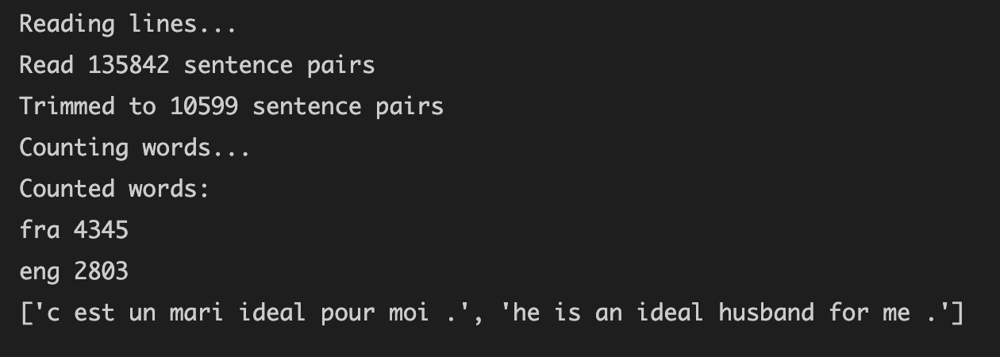

# Eng-Fra Translator

```python
from __future__ import unicode_literals, print_function, division
from io import open
import unicodedata
import string
import re
import random

import torch
import torch.nn as nn
from torch import optim
import torch.nn.functional as F

device = torch.device("cuda" if torch.cuda.is_available() else "cpu")
```

### 1\) 데이터 준비 과정



```python
SOS_token = 0
EOS_token = 1

class Lang:
    def __init__(self, name):
        self.name = name
        self.word2index = {}
        self.word2count = {}
        self.index2word = {0: "SOS", 1: "EOS"}
        self.n_words = 2
        
    def addSentence(self, sentence):
        for word in sentence.split(' '):
            self.addWord(word)
    
    def addWord(self, word):
        if word not in self.word2index:
            self.word2index[word] = self.n_words
            self.word2count[word] = 1
            self.index2word[self.n_words] = word
            self.n_words += 1
        else: 
            self.word2count[word] += 1
```

이번 task에서는 one-hot encoding을 이용하려고 한다. one-hot encoding은 문자를 단어 0으로 이루어진 엄청 큰 벡터에서 특정 단어가 가진 특정한 index에만 1을 넣는 one-hot vector로 나타내는 것을 말한다.

학습 이전에 위 과정을 쉽게 하기 위하여, 클래스 `'Lang'`을 제작하였다. 단어를 index에 대응시킨 `word2index`와 index에 단어를 대응시킨 `index2word`를 선언한다. seq2seq에 필수적으로 들어가는 토큰인 "SOS"와 "EOS"는 미리 추가해놓고, 이를 포함하여 `n_words`는 2로 초기화시켜 놓았다.

함수 addSentence는 ' '를 기준으로 문장을 쪼개서 단어를 받는 함수이다. addWord는 addSentence로부터 받은 word를 `word2index`와 `index2word`에 추가시키고, `n_words`에 1을 더해준다. 문장으로부터 받은 단어가 이미 `word2index`에 있다면, `n_words`에만 1 더해준다.

```python
def unicodeToAscii(s):
    return ''.join(
        c for c in unicodedata.normalize('NFD', s)
        if unicodedata.category(c) != 'Mn'
    )

def normalizeString(s):
    s = unicodeToAscii(s.lower().strip())
    s = re.sub(r"([.!?])", r" \1", s)
    s = re.sub(r"[^a-zA-Z.!?]+", r" ", s)
    return s
```

다음은 문장을 정규화하는 과정이다. 위에 첨부해놓은 data.zip은 모두 Unicode로 이루어져있다. 이를 ASCII로 변환해주고, 대문자를 모두 소문자로 변경해준다. 또한, 문장부호와 알파벳을 제외한 모든 단어를 제거해준다. 다시 한번 언급하자면, 컴퓨터는 소문자와 대문자가 섞여있다면, 다른 단어로 인식한다. 또한, 문장부호가 붙어있는 것도 마찬가지이다. 그리하여, 납득할만한 결과를 얻기 위하여 이러한 데이터 전처리 과정이 필수적이다. \(한국어를 다룰 때에는 형태소 분석기 사용을 추천한다\)

한국어를 다룰 때, 위에 있는 unicodeToAscii 함수를 사용하면, 한국어 데이터가 그대로 없어진다.

```python
ef readLangs(lang1, lang2, reverse=False):
    print("Reading lines...")
    
    lines = open('%s-%s.txt' % (lang1, lang2), encoding='utf-8').read().strip().split('\n')
    pairs = [[normalizeString(s) for s in l.split('\t')] for l in lines]
    
    if reverse:
        pairs = [list(reversed(p)) for p in pairs]
        input_lang = Lang(lang2)
        output_lang = Lang(lang1)
    else: 
        input_lang = Lang(lang1)
        output_lang = Lang(lang2)
        
    return input_lang, output_lang, pairs
```

본격적으로 data를 추출하는 단계이다. data.zip의 압축을 풀고, python 파일과 같은 디렉토리 내에 `eng-fra.txt`와 같이 저장해준다. `.read().strip().split('\n)`을 통해서 메모장에 있는 파일을 줄 단위로 받아온다. \(`.strip()`은 문자열의 양 끝에 있는 공백 혹은 \n을 제거해주는 함수이다.

그 다음에 한 줄에서 영어 문장 한 개와 프랑스어 문장 한 개 짝을 이루어서 받아오는 pair를 만들어준다. 메모장에서 한 줄에 영어와 프랑스어가 tab으로 구분되어 있어 `.split('\t')`으로 pair를 만든다.

```python
MAX_LENGTH = 10

eng_prefixes = (
    "i am ", "i m ",
    "he is", "he s ",
    "she is", "she s ",
    "you are", "you re ",
    "we are", "we re ",
    "they are", "they re "
)

def filterPair(p):
    return len(p[0].split(' ')) < MAX_LENGTH and len(p[1].split(' ')) < MAX_LENGTH and p[1].startswith(eng_prefixes)
    # 만약 reverse=False면 p[0].starswith(eng_prefixes)

def filterPairs(pairs):
    return [pair for pair in pairs if filterPair(pair)]
```

본래는 모든 데이터를 학습시키는 데에는 꽤 오랜 시간을 요구한다. 이러한 시간을 조금 줄이고자, 몇가지 필터링을 추가시키고자 한다.  
1\) 문장의 길이가 MAXLENGTH 이하인 문장만 학습한다.  
2\) eng\_prefixes를 선언하여, 이의 형태로 시작하는 문장만 골라서 학습한다.

```python
def prepareData(lang1, lang2, reverse=False):
    input_lang, output_lang, pairs = readLangs(lang1, lang2, reverse)
    print("Read %s sentence pairs" % len(pairs))
    pairs = filterPairs(pairs)
    print("Trimmed to %s sentence pairs" % len(pairs))
    print("Counting words...")
    
    for pair in pairs:
        input_lang.addSentence(pair[0])
        output_lang.addSentence(pair[1])
    
    print("Counted words:")
    print(input_lang.name, input_lang.n_words)
    print(output_lang.name, output_lang.n_words)
    return input_lang, output_lang, pairs
```



### 2\) Encoder, Decoder 제작

```python
class EncoderRNN(nn.Module):
    def __init__(self, input_size, hidden_size):
        super(EncoderRNN, self).__init__()
        self.hidden_size = hidden_size
        
        self.embedding = nn.Embedding(input_size, hidden_size)
        self.gru = nn.GRU(hidden_size, hidden_size)
    
    def forward(self, input, hidden):
        embedded = self.embedding(input).view(1, 1, -1)
        output = embedded
        output, hidden = self.gru(output, hidden)
        return output, hidden
    
    def initHidden(self):
        return torch.zeros(1, 1, self.hidden_size, device=device)
```

앞선 챕터에서 명한 RNN과 매우 유사한 구조이다. 더 자세한 설명은 gitbook에서 RNN 부분을 참고하면될 것 같다. 더 나은 퍼포먼스를 위하여 RNN 셀이 아닌 GRU 셀을 이용하였다. hidden state의 초기값은 `torch.zeros`를 이용하여 0으로 주었다.


```python
class DecoderRNN(nn.Module):
    def __init__(self, hidden_size, output_size):
        super(DecoderRNN, self).__init__()
        self.hidden_size = hidden_size
        
        self.embedding = nn.Embedding(output_size, hidden_size)
        self.gru = nn.GRU(hidden_size, hidden_size)
        self.out = nn.Linear(hidden_size, output_size)
        self.softmax = nn.LogSoftmax(dim=1)
    
    def forward(self, input, hidden):
        output = self.embedding(input).view(1, 1, -1)
        # what does .view(1, 1, -1) mean?
        output = F.relu(output)
        output, hidden = self.gru(output, hidden)
        output = self.softmax(self.out(output[0]))
        return output, hidden
    
    def initHidden(self):
        return torch.zeros(1, 1, self.hidden_size, device=device)
```

Decoder 또한 GRU 셀을 이용하였고, 활성화 함수는 ReLU를 이용했다. 이후에, 최종 ouput은 Softmax 함수를 이용하여, 다음에 올 확률이 가장 높은 단어를 선택할 수 있도록 한다. Encoder와 Decoder 둘 다 첨부한 사진을 토대로 코드와 비교하면서 보면 이해를 도울 수 있다. 


### 3\) Training

```python
def indexesFromSentence(lang, sentence):
    return [lang.word2index[word] for word in sentence.split(' ')]

def tensorFromSentence(lang, sentence):
    indexes = indexesFromSentence(lang, sentence)
    indexes.append(EOS_token)
    # Why append the EOS tokens for both input/output tensor sequence
    return torch.tensor(indexes, dtype=torch.long, device=device).view(-1, 1)

def tensorsFromPair(pair):
    input_tensor = tensorFromSentence(input_lang, pair[0])
    target_tensor = tensorFromSentence(output_lang, pair[1])
    return (input_tensor, target_tensor)
```

실제 training을 거치기 이전에 앞서 준비한 데이터를 tensor로 바꿔주는 과정을 거쳐야한다. 문장으로부터 index를 받아오는 `indexesFromSentence`함수, 문장을 tensor로 변환하는 `tensorFromSentece` 함수, 한 개의 영어 문장과 한 개의 프랑스어 문장으로 이루어진 Pair를 `input_tensor`와 `target_tensor`로 return해주는 `tensorsFromPair` 함수를 제작한다. 

```python
teacher_forcing_ratio = 1

def train(input_tensor, target_tensor, encoder, decoder, encoder_optimizer, decoder_optimizer, criterion,
          max_length=MAX_LENGTH):
    encoder_hidden = encoder.initHidden()
    
    encoder_optimizer.zero_grad()
    decoder_optimizer.zero_grad()
    input_length = input_tensor.size(0)
    target_length = target_tensor.size(0)
    
    encoder_outputs = torch.zeros(max_length, encoder.hidden_size, device=device)
    loss = 0
    
    for ei in range(input_length):
        encoder_output, encoder_hidden = encoder(input_tensor[ei], encoder_hidden)
        encoder_outputs[ei] = encoder_output[0, 0]
    
    decoder_input = torch.tensor([[SOS_token]], device=device)
    decoder_hidden = encoder_hidden 
    
    '''
    Teacher Forcing
    '''
        
    loss.backward()
    
    encoder_optimizer.step()
    decoder_optimizer.step()
    
    return loss.item() / target_length
    
```

'Teacher Forcing' 혹은 '교사 강요'는 input과 Decoder가 예측한 단어가 아닌 실제 정답인 target을 이용해서 학습을 시키는 것을 말한다. 'Teacher Forcing'을 이용하지 않을 때에는 Decoder가 예측하는 단어를 target으로 설정하여, 학습을 진행시키는 것이다. 

'학습'은 적절한 input과 target을 이용하여, 다음에 input을 모델에 주었을 때, 적절한 target을 예측할 수 있게 하는 것이다. 하지만, 교사 강요를 거치지 않고, Decoder가 예측한 단어들을 아직 '정답'이라고 볼 수는 없다. 

```python
    use_teacher_forcing = True if random.random() < teacher_forcing_ratio else False
    if use_teacher_forcing:
        for di in range(target_length):
            decoder_output, decoder_hidden= decoder(decoder_input, decoder_hidden)
            loss += criterion(decoder_output, target_tensor[di])
            decoder_input = target_tensor[di]

    else:
        for di in range(target_length):
            decoder_output, decoder_hidden = decoder(decoder_input, decoder_hidden)
            topv, topi = decoder_output.topk(1)
            decoder_input = topi.squeeze().detach()

            loss += criterion(decoder_output, target_tensor[di])
            if decoder_input.item() == EOS_token:
                break
```

위 코드를 `'''Teacher Forcing'''` 부분에 삽입하면 된다. 

이 코드에서는 `teacher_forcing_ratio`이라는 변수에 0~1 값을 선언하여, 'Teacher Forcing'을 거치는 비율 또한 설정할 수 있다. `if use_teacher_forcing:` 에서는 위에서 설명한대로 loss값을 ouput과 target\_tensor로 구하는 것을 볼 수 있다. 

`else:` 에서는 교사 강요를 사용하지 않고 Decoder가 예측한 값을 이용하고자 한다. DecoderRNN 클래스를 보면, Decoder는 output과 hidden state를 매번 return한다.   
`.topk()`은 가장 큰 element를 반환해주는 함수이다.  
[torch.topk documentation: https://pytorch.org/docs/stable/generated/torch.topk.html](https://pytorch.org/docs/stable/generated/torch.topk.html)`torch.topk`는 return 값으로 가장 큰 element의 value와 그 index를 return한다. 

즉, `decoder_output.topk(1)`에서 가장 큰 value를 가진 element 한 개를 내보내는데, 그 element의 value는 `topv`, 그 index는 `topi`에 저장한다. 위 과정을 console 창에서 밑과 같이 확인할 수 있다.


결국, `torch.topk`를 이용하여 Decoder에서 가장 다음에 올 확률이 큰 단어를 정하는 것이다. 그리고, 그 단어의 index를 뽑아서, 다음 Decoder의 `decoder_input`으로 넣어준다.   
`decoder_input = topi.squeeze().detach()`에서 `.squeeze()`는 혹시 size가 1인 dimension을 삭제해주는 함수이고, `.detach()`는 `with torch.no_grad():`와 같다고 생각하면 편다. Decoder에 input으로 넣을 이 변수에서 더 이상 gradient를 요구하지 않고, back propagation에 의해서 변하지 않게 한다. [torch.Tensor.detach documentation: https://pytorch.org/docs/stable/generated/torch.Tensor.detach.html](https://pytorch.org/docs/stable/generated/torch.Tensor.detach.html)


~~Q\) `.squeeze()`를 왜 넣었는가? index가 1인 단어는 &lt;EOS&gt;라서 인가?~~

```python
'''
import time
import math


def asMinutes(s):
    m = math.floor(s / 60)
    s -= m * 60
    return '%dm %ds' % (m, s)


def timeSince(since, percent):
    now = time.time()
    s = now - since
    es = s / (percent)
    rs = es - s
    return '%s (- %s)' % (asMinutes(s), asMinutes(rs))
'''

def trainIters(encoder, decoder, n_iters, print_every=1000, plot_every=100, learning_rate=0.01):
    start = time.time()
    plot_losses = []
    print_loss_total = 0
    plot_loss_total = 0
    
    encoder_optimizer = optim.SGD(encoder.parameters(), lr=learning_rate)
    decoder_optimizer = optim.SGD(decoder.parameters(), lr=learning_rate)
    training_pairs = [tensorsFromPair(random.choice(pairs)) for i in range(n_iters)]
    criterion = nn.NLLLoss()
    
    for iter in range(1, n_iters+1): 
        training_pair = training_pairs[iter-1]
        input_tensor  = training_pair[0]
        target_tensor = training_pair[1]
        
        loss = train(input_tensor, target_tensor, encoder, decoder, encoder_optimizer, decoder_optimizer, criterion)
        print_loss_total += loss
        plot_loss_total += loss
        
        if iter % print_every == 0:
            print_loss_avg = print_loss_total / print_every
            print_loss_total = 0
            print('%s (%d %d%%) %.4f' % (timeSince(start, iter / n_iters),
                                         iter, iter / n_iters * 100, print_loss_avg))

        if iter % plot_every == 0:
            plot_loss_avg = plot_loss_total / plot_every
            plot_losses.append(plot_loss_avg)
            plot_loss_total = 0
```

optimizer로는 SGD를 사용하였고, loss Function으로는 NLLLoss를 사용했다.  
학습 중에 진행 과정을 시각화 해주기 위하여, asMinute 함수와 timeSince 함수를 만들어주었다.

```python
hidden_size = 256
encoder1 = EncoderRNN(input_lang.n_words, hidden_size).to(device)
decoder1 = DecoderRNN(hidden_size, output_lang.n_words).to(device)

trainIters(encoder1, decoder1, 75000, print_every=5000)
```

이 코드에서 GRU 셀로 만든 Encoder와 Decoder 이용한다. \(이후에는 'Attention'을 추가한 Decoder를 적용해보고자 한다\) Iter 횟수는 75000번, 5000번마다 진행상황을 출력하도록 했다.


### 4\) Evaluate

```python
def evaluate(encoder, decoder, sentence, max_length=MAX_LENGTH):
    with torch.no_grad():
        input_tensor = tensorFromSentence(input_lang, sentence)
        input_length = input_tensor.size()[0]
        encoder_hidden = encoder.initHidden()

        encoder_outputs = torch.zeros(max_length, encoder.hidden_size, device=device)

        for ei in range(input_length):
            encoder_output, encoder_hidden = encoder(input_tensor[ei],encoder_hidden)
            encoder_outputs[ei] += encoder_output[0, 0]
        
        # SOS
        decoder_input = torch.tensor([[SOS_token]], device=device)
        decoder_hidden = encoder_hidden

        decoded_words = []
        # decoder_attentions = torch.zeros(max_length, max_length)

        for di in range(max_length):
            decoder_output, decoder_hidden = decoder(decoder_input, decoder_hidden)
            # decoder_attentions[di] = decoder_attention.data
            topv, topi = decoder_output.data.topk(1)
            if topi.item() == EOS_token:
                decoded_words.append('<EOS>')
                break
            else:
                decoded_words.append(output_lang.index2word[topi.item()])

            decoder_input = topi.squeeze().detach()

        return decoded_words # decoder_attentions[:di + 1]
    
def evaluateRandomly(encoder, decoder, n=5):
    for i in range(n):
        pair = random.choice(pairs)
        print('>', pair[0])
        print('=', pair[1])
        output_words = evaluate(encoder, decoder, pair[0])
        output_sentence = ' '.join(output_words)
        print('<', output_sentence)
        print('')

evaluateRandomly(encoder1, decoder1)

def translate(sentence):
    output_words = evaluate(encoder1, decoder1, sentence)
    output_sentence = ' '.join(output_words)
    print(output_sentence)
```

Decoder는 처음에 input으로 &lt;SOS&gt;와 이전 hidden state인 `encoder_hidden`을 받는다. 그리고, 이전에 설명했던 .topk를 이용하여 다음 단어를 예측한다. topi에 저장되어 있는 다음에 올 확률이 가장  단어의 index로 index2word에서 word를 조회하여 계속해서 문단어를 장에 더해준다. 마지막으로 index로 &lt;EOS&gt;를 받으면 마지막 문장에 &lt;EOS&gt;를 append하고 종료한다.

따로 translate라는 함수를 만들어놓았으므로, word2index에 이미 존재하는 word에 한해서, string 형식으로 프랑스어를 입력한다면, 앞서 만든 모델이 번역한 영어 문장을 받아볼 수 있다.  
\(Attention 관련한 부분은 일단 주석처리 하였다\)


사진 및 내용 출처:  
[https://pytorch.org/tutorials/intermediate/seq2seq\_translation\_tutorial.html](https://pytorch.org/tutorials/intermediate/seq2seq_translation_tutorial.html)

